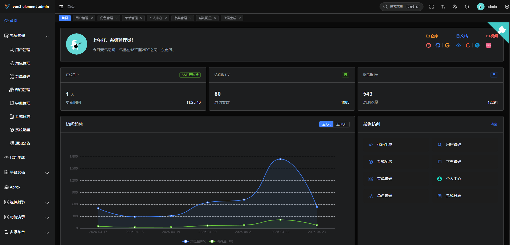

<div align="center">


# vue3-element-template

**Vue3 + Vite + TypeScript Enterprise Admin Frontend Template**

[](https://vuejs.org/)
[](https://vitejs.dev/)
[](https://element-plus.org/)
[](https://gitee.com/youlaiorg/vue3-element-template/stargazers)
[](https://github.com/youlaitech/vue3-element-template)
[](https://gitcode.com/youlai/vue3-element-template/stargazers)
[](LICENSE)

</div>


<div align="center">

[🖥️ Live Preview](https://vue.youlai.tech/template) | [📖 Documentation](https://www.youlai.tech/vue3-element-admin) | [💬 中文](README.md)

</div>


## Introduction

[vue3-element-admin](https://gitee.com/youlaiorg/vue3-element-admin) is a free and open-source admin template for backend management frontend, built with popular technologies such as Vue3, Vite5, TypeScript, Element-Plus, and Pinia (with accompanying [backend source code](https://gitee.com/youlaiorg/youlai-boot)).


## Project Features

- **Simple and Easy-to-use**: Upgraded version of [vue-element-admin](https://gitee.com/panjiachen/vue-element-admin) for Vue3, with minimal encapsulation and easy to get started.

- **Data Interaction**: Support both local `Mock` data and remote API. Comes with [Java backend source code](https://gitee.com/youlaiorg/youlai-boot) and online API documentation.

- **Permission Management**: Complete permission system for users, roles, menus, dictionaries, and departments.

- **Essential Infrastructure**: Dynamic routing, button permissions, internationalization, code style, Git commit conventions, and common component encapsulation.

- **Continuous Updates**: Since 2021, the project has maintained an open-source status with continuous updates, integrating new tools and dependencies in real time, and has accumulated a broad user base.

## System Preview

**PC**

<table align="center">
  <tr>
    <td></td>
    <td></td>
  </tr>
  <tr>
    <td></td>
    <td></td>
  </tr>
  <tr>
    <td></td>
    <td></td>
  </tr>
</table>

**Mobile**

<table align="center">
  <tr>
    <td></td>
    <td></td>
    <td></td>
    <td></td>
  </tr>
</table>

## Ecosystem

**Frontend**

| Project | Tech Stack | Description |
|:-----|:-------|:-----|
| [vue3-element-admin](https://gitee.com/youlaiorg/vue3-element-admin) | Vue 3 + Vite + TS + Element Plus | PC Admin (Main) |
| [vue3-element-admin-js](https://gitee.com/youlaiorg/vue3-element-admin-js) | Vue 3 + Vite + JS + Element Plus | JavaScript Version |
| [vue3-element-template](https://gitee.com/youlaiorg/vue3-element-template) | Vue 3 + Vite + TS + Element Plus | Lite Template |
| [youlai-app](https://gitee.com/youlaiorg/youlai-app) | Vue 3 + UniApp | Mobile App |

**Backend**

| Project | Tech Stack | Description |
|:-----|:-------|:-----|
| [youlai-boot](https://gitee.com/youlaiorg/youlai-boot) | Spring Boot + MyBatis-Plus | Java Backend (Main) |
| [youlai-nest](https://gitee.com/youlaiorg/youlai-nest) | NestJS + TypeORM | Node.js |
| [youlai-gin](https://gitee.com/youlaiorg/youlai-gin) | Go + Gorm | Go |
| [youlai-django](https://gitee.com/youlaiorg/youlai-django) | Django + DRF | Python |
| [youlai-think](https://gitee.com/youlaiorg/youlai-think) | ThinkPHP 8 | PHP |
| [youlai-aspnet](https://gitee.com/youlaiorg/youlai-aspnet) | ASP.NET Core | C# |

> **youlai-boot** also provides variants: [Multi-tenant](https://gitee.com/youlaiorg/youlai-boot-tenant) · [MyBatis-Flex](https://gitee.com/youlaiorg/youlai-boot-flex) · [Spring Boot 3](https://gitee.com/youlaiorg/youlai-boot/tree/spring-boot-3) · [PostgreSQL](https://gitee.com/youlaiorg/youlai-boot/tree/db-pg) · [Multi-module](https://gitee.com/youlaiorg/youlai-boot/tree/multi-module)
>
> All six backends share the same **RESTful API** and **database schema**, frontends can switch seamlessly.

## Project Setup

```bash
# Clone the repository
git clone https://gitee.com/youlaiorg/vue3-element-template.git

# Change directory
cd vue3-element-template

# Install pnpm
npm install pnpm -g

# Install dependencies
pnpm install

# Start the project
pnpm run dev
```

## Project Deployment

```bash
# Build the project
pnpm run build

# Upload files to the remote server
Copy the files generated in the `dist` directory to the `/usr/share/nginx/html` directory.

# nginx.cofig configuration
server {
	listen     80;
	server_name  localhost;
	location / {
			root /usr/share/nginx/html;
			index index.html index.htm;
	}
	# Reverse proxy configuration
	location /prod-api/ {
			proxy_pass http://vapi.youlai.tech/; # Replace vapi.youlai.tech with your backend API address
	}
}
```

## Local Mock

The project supports both online API and local mock API. By default, it uses the online API. If you want to switch to the mock API, modify the value of `VITE_MOCK_DEV_SERVER` in the `.env.development` file to `true`.

## Backend API

> If you have a basic understanding of Java development, follow these steps to convert online API to local backend API and set up a full-stack development environment.

1. Get the backend source code based on `Java` and `SpringBoot` from [youlai-boot](https://gitee.com/youlaiorg/youlai-boot.git).
2. Follow the instructions in the backend project's README.md to set up the local environment.
3. Modify the value of `VITE_APP_API_URL` in the `.env.development` file to `http://localhost:8989`, replacing it with the backend API URL.

## Notes

- **Auto import plugin is disabled by default**

  Component type declarations have been automatically generated for the template project. If you add and use new components, follow the instructions in the screenshot to enable automatic generation. After automatic generation is complete, remember to set it back to `false` to avoid conflicts.

  

- **Blank page when accessing the project**

  Try upgrading your browser, as older browser engines may not support certain new JavaScript syntax, such as optional chaining operator `?.`.

- **Red highlight on project components, functions, and imports**

  Restart VSCode to try again.

- **Other issues**

  If you have any other issues or suggestions, please open an [issue](https://gitee.com/youlaiorg/vue3-element-admin/issues/new).

## Project Documentation

- [Building a Backend Management System from Scratch with Vue3, Vite, TypeScript, and Element-Plus](https://blog.csdn.net/u013737132/article/details/130191394)

- [ESLint+Prettier+Stylelint+EditorConfig for Standardized and Unified Frontend Code Style](https://blog.csdn.net/u013737132/article/details/130190788)
- [Git Commit Conventions with Husky, Lint-staged, Commitlint, Commitizen, and cz-git](https://blog.csdn.net/u013737132/article/details/130191363)

## Commit Conventions

Execute `pnpm run commit` to invoke interactive git commit and complete the information input and selection according to the prompts.


---

<table align="center">
  <tr>
    <td align="center">
      <br>
      <sub>WeChat Official Account</sub>
    </td>
    <td>&nbsp;&nbsp;&nbsp;&nbsp;</td>
    <td align="center">
      <br>
      <sub>Mini Program</sub>
    </td>
    <td>&nbsp;&nbsp;&nbsp;&nbsp;</td>
    <td align="center">
      <br>
      <sub>Add Author WeChat</sub>
    </td>
  </tr>
</table>

<p align="center"><em>Technical Exchange · Issue Feedback · Business Cooperation</em></p>

## License

[MIT](LICENSE)

